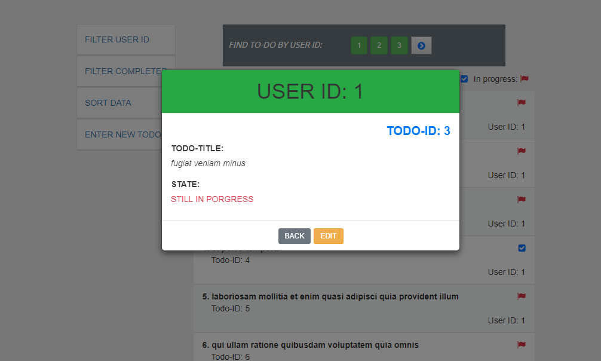

# Name : To-do List Management
## Javascript Library : React.js
## CSS : Bootstrap v3 / v4
## Setup
##### You can use this app by cloning or downloading zip file in this repository. 
##### The following guide is mainly created for the users who do not use 'git clone'. 
### 1. Must install npm ( or yarn)
### 2. Make a root folder : ex) mkdir Chisel
### 3. At the root folder : ex) npm install -g create-ract-app
### 4. At the root folder : ex) create-react-app todos
### 5. Copy the follwing code. It is required because to utilize bootstrap v3 and v4 at the same time.
### 6. Paste the code above into your 'index.html' in 'public' folder in 'todos' created above.
### 7. In your public folder, create 'style' folder: mkdir style
### 8. Create 'style.css' file to be implemented for styling.
### 9. Copy the code of style.css in this GitHub and paste it into 'style.css' file just created in your local PC
### 10. Install the following packages
##### command) npm install --save axios lodash react-bootstrap react-redux redux redux-thunk
### 11. Copy delete 'src' folder in your PC and copy 'src' folder in this GitHub and paste it into your PC
### 12. Run command (command) 'npm start' / 'npm run start' to start!

<!DOCTYPE html>
<html lang="en">
  <head>
    <meta charset="utf-8">
    <meta name="viewport" content="width=device-width, initial-scale=1.0" />
    <meta http-equiv="X-UA-Compatible" content="ie=edge" />

    <link rel="stylesheet" type="text/css" href="../style/style.css" />

    <link
      rel="stylesheet"
      href="https://cdnjs.cloudflare.com/ajax/libs/font-awesome/4.7.0/css/font-awesome.min.css"
    />

    <link
      rel="stylesheet"
      href="https://stackpath.bootstrapcdn.com/bootstrap/4.1.1/css/bootstrap.min.css"
      integrity="sha384-WskhaSGFgHYWDcbwN70/dfYBj47jz9qbsMId/iRN3ewGhXQFZCSftd1LZCfmhktB"
      crossorigin="anonymous"
    />

    <link
      rel="stylesheet"
      href="https://maxcdn.bootstrapcdn.com/bootstrap/3.3.7/css/bootstrap.min.css"
      integrity="sha384-BVYiiSIFeK1dGmJRAkycuHAHRg32OmUcww7on3RYdg4Va+PmSTsz/K68vbdEjh4u"
      crossorigin="anonymous"
    />

    <link
      href="https://fonts.googleapis.com/css?family=Ubuntu"
      rel="stylesheet"
    />
    <link
      async
      href="https://fonts.googleapis.com/css?family=Warnes"
      data-generated="https://enjoycss.com"
      rel="stylesheet"
      type="text/css"
    />
    <title>Todos</title>
  </head>
  <body>
    <noscript>
      You need to enable JavaScript to run this app.
    </noscript>
    

    <!--
      This HTML file is a template.
      If you open it directly in the browser, you will see an empty page.

      You can add webfonts, meta tags, or analytics to this file.
      The build step will place the bundled scripts into the <body> tag.

      To begin the development, run `npm start` or `yarn start`.
      To create a production bundle, use `npm run build` or `yarn build`.
    -->
     
    
  </body>
</html>

## APP Design
### 
